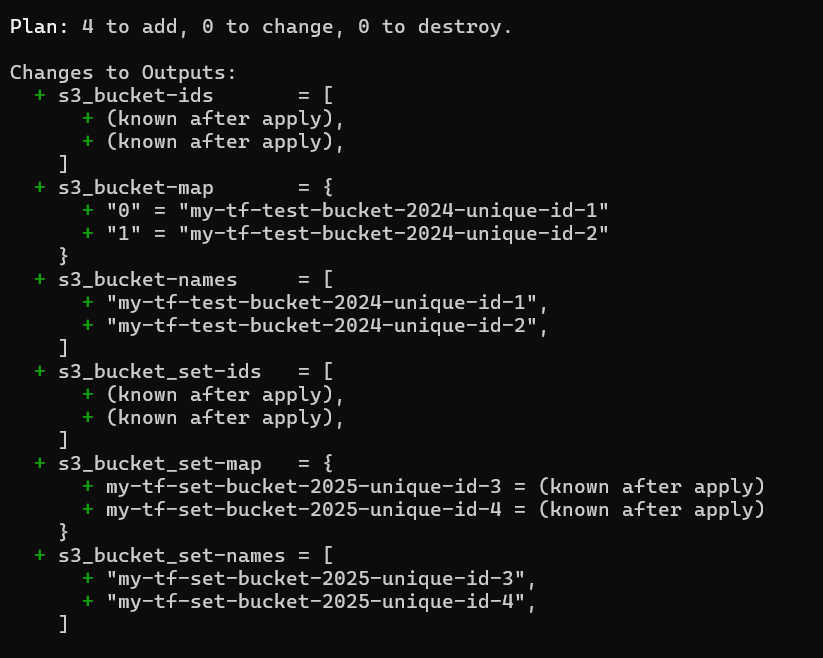

# Day 08: Terraform Meta-Arguments - Complete Guide

Welcome to Day 08 of the Terraform AWS Course! This lesson provides **comprehensive coverage of all Terraform meta-arguments** with simple, practical examples.

## 📚 What You'll Learn

- Understanding all Terraform meta-arguments
- **count** - Create multiple resources with numeric indexing
- **for_each** - Create multiple resources with maps/sets
- **depends_on** - Explicit resource dependencies
- Output transformations with `for` expressions
- Best practices for each meta-argument

## 📁 Lesson Structure

```
day08/
├── provider.tf      # AWS provider configuration
├── variables.tf     # Input variables (list, set, map, object types)
├── local.tf         # Local values and common tags
├── backend.tf       # S3 backend configuration
├── main.tf          # Main resource definitions with count and for_each examples
├── output.tf        # Output values demonstrating for loops
├── task.md          # Hands-on exercises and tasks
└── README.md        # This file


## 🎯 Key Concepts

### Meta-Arguments Overview

Meta-arguments are special arguments that can be used with **any resource type** to change the behavior of resources:

1. **count** - Create multiple resource instances based on a number
2. **for_each** - Create multiple resource instances based on a map or set
3. **depends_on** - Explicit resource dependencies

**This lesson includes simple examples for all meta-arguments!**

### COUNT Meta-Argument

```hcl
resource "aws_s3_bucket" "example" {
  count  = 3
  bucket = "my-bucket-${count.index}"
}
```

**Use cases:**
- Creating N identical resources
- Simple iteration over a list
- When numeric index is sufficient

**Limitations:**
- Removing items from the middle of a list causes resource recreation
- Less stable resource addressing
- Harder to maintain

### FOR_EACH Meta-Argument

```hcl
resource "aws_s3_bucket" "example" {
  for_each = toset(["bucket1", "bucket2", "bucket3"])
  bucket   = each.value
}
```

**Use cases:**
- Creating resources from a map or set
- Stable resource addressing by key
- Production environments
- Complex resource configurations

**Benefits:**
- Adding/removing items doesn't affect other resources
- More readable resource references
- Better for production use

### DEPENDS_ON Meta-Argument

```hcl
resource "aws_s3_bucket" "dependent" {
  bucket = "my-bucket"
  
  depends_on = [aws_s3_bucket.primary]
}
```

**Use cases:**
- Explicit resource ordering
- Hidden dependencies not captured by references
- Ensuring resources are created in specific order

## 🚀 Quick Start

### Prerequisites

- Terraform >= 1.9.0
- AWS CLI configured with appropriate credentials
- Basic understanding of Terraform syntax

### Steps

1. **Clone and navigate to the lesson folder:**
   ```bash
   cd lessons/day08
   ```

2. **Update variables (important!):**
   - Edit `variables.tf` or create a `terraform.tfvars` file
   - Change S3 bucket names to be globally unique
   - Update AWS region if needed

3. **Initialize Terraform:**
   ```bash
   terraform init
   ```

4. **Format your code:**
   ```bash
   terraform fmt
   ```

5. **Validate configuration:**
   ```bash
   terraform validate
   ```

6. **Review the execution plan:**
   ```bash
   terraform plan
   ```

7. **Apply (optional):**
   ```bash
   terraform apply
   ```

8. **View outputs:**
   ```bash
   terraform output
   ```

9. **Cleanup:**
   ```bash
   terraform destroy
   ```

## 📝 Examples Included

### 1. COUNT Meta-Argument
- Creates multiple S3 buckets using a list variable
- Demonstrates `count.index` usage
- Index-based resource addressing

### 2. FOR_EACH Meta-Argument (Set)
- Creates S3 buckets using a set variable
- Demonstrates `each.key` and `each.value`
- More stable resource addressing

### 3. DEPENDS_ON Meta-Argument
- Shows explicit resource dependencies
- Primary and dependent bucket example
- Control resource creation order

## Output:


### 6. Advanced Outputs
- Splat expressions (`[*]`)
- For loops in outputs
- Map transformations
- Combined outputs

## 🎓 Learning Path

1. **Start with Task 1-3** in `task.md` to understand the basics
2. **Practice with Task 4-5** to create your own resources
3. **Master outputs with Task 6**
4. **Deep dive with Task 7** to understand count vs for_each differences
5. **Apply knowledge with Task 8** for a real-world scenario

## ⚠️ Important Notes

### S3 Bucket Names
- S3 bucket names must be **globally unique** across all AWS accounts
- Update the default bucket names in `variables.tf` before applying
- Use your organization prefix or a unique identifier

### Backend Configuration
- The `backend.tf` uses S3 for remote state
- Comment out the backend block if you want to use local state
- Create the S3 bucket manually before running `terraform init`

### Costs
- Most resources in this lesson are free tier eligible
- S3 buckets incur minimal storage costs
- IAM users are free
- **Always run `terraform destroy` when done!**

## 🔍 Key Differences: COUNT vs FOR_EACH

| Feature | COUNT | FOR_EACH |
|---------|-------|----------|
| **Input Type** | Number or list | Map or set |
| **Addressing** | Numeric index `[0]` | Key-based `["name"]` |
| **Stability** | Less stable | More stable |
| **Item Removal** | May recreate resources | Only removes specific resource |
| **Use Case** | Simple scenarios | Production environments |
| **Readability** | Index-based | Name-based (better) |

## 💡 Best Practices

1. **Prefer for_each over count** in production environments
2. **Use meaningful keys** when using for_each with maps
3. **Use toset()** to convert lists to sets for for_each
4. **Add proper tags** to all resources for better organization
5. **Document your choices** - explain why you chose count or for_each
6. **Test removals** - understand what happens when you remove items

## 🔗 Additional Resources

- [Terraform Count Meta-Argument](https://www.terraform.io/language/meta-arguments/count)
- [Terraform For_Each Meta-Argument](https://www.terraform.io/language/meta-arguments/for_each)
- [For Expressions](https://www.terraform.io/language/expressions/for)
- [Splat Expressions](https://www.terraform.io/language/expressions/splat)

## 🐛 Troubleshooting

### Issue: "Bucket name already exists"
**Solution:** S3 bucket names are globally unique. Change the bucket names in your variables.

### Issue: "Invalid for_each argument"
**Solution:** for_each requires a map or set. Use `toset()` to convert a list to a set.

### Issue: "Resource not found when using count"
**Solution:** Make sure you're using the correct index. Remember that count uses numeric indices starting from 0.

